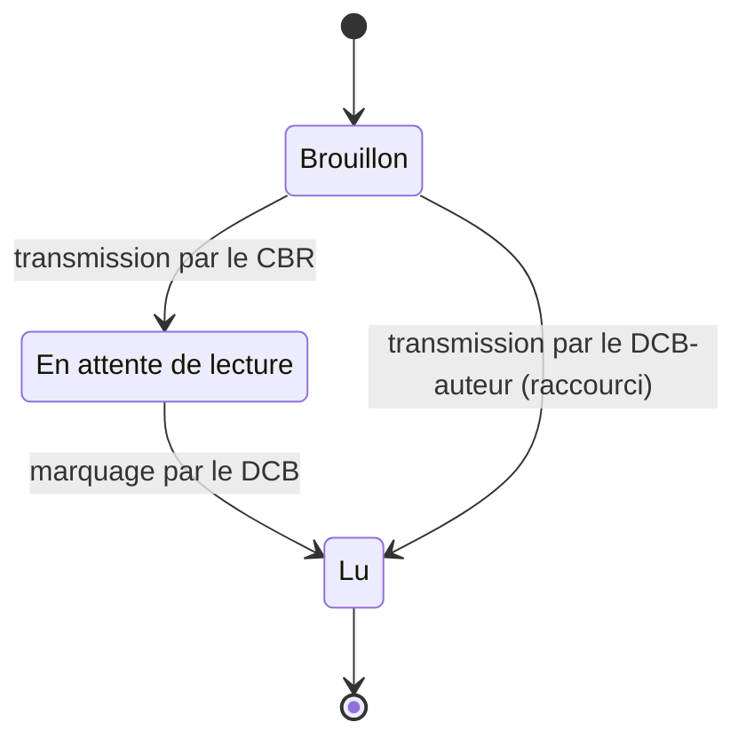
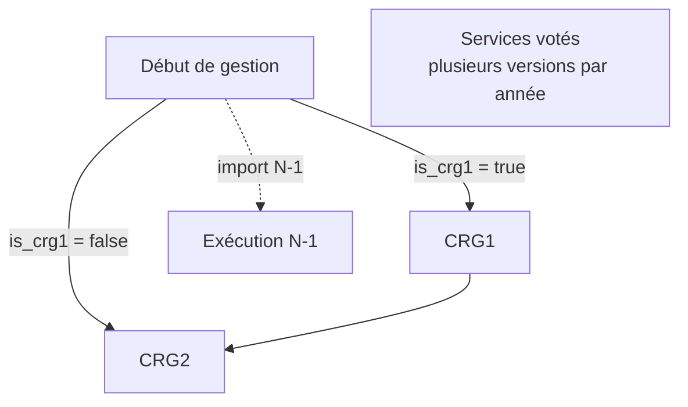
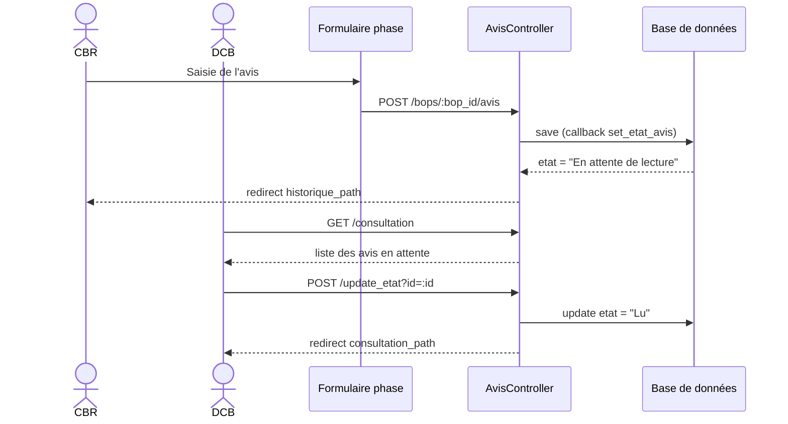

# Fonctionnalité Avis

Ce document décrit la fonctionnalité **Avis** de l'application avisbop telle qu'elle existe aujourd'hui dans le code. Il couvre le modèle de données, le cycle de vie d'un avis, les parcours utilisateur (création, visualisation, consultation), les tableaux de bord, ainsi que les opérations d'administration (imports, exports, sauvegarde).

Sauf indication contraire, toutes les routes documentées sont préfixées par le scope `/anaco` défini dans [config/routes.rb](../config/routes.rb).

## Sommaire

1. [Introduction](#1-introduction)
2. [Modèle de données](#2-modèle-de-données)
3. [Cycle de vie d'un avis](#3-cycle-de-vie-dun-avis)
4. [Création d'un avis](#4-création-dun-avis)
5. [Visualisation](#5-visualisation)
6. [Tableaux de bord et restitutions](#6-tableaux-de-bord-et-restitutions)
7. [Administration](#7-administration)
8. [Référence technique](#8-référence-technique)
9. [Annexes](#9-annexes)

---

## 1. Introduction

### 1.1 Qu'est-ce qu'un avis ?

Un **avis** est l'évaluation portée par un Contrôleur Budgétaire Régional (CBR) sur un Budget Opérationnel de Programme (BOP) à un moment donné de l'année budgétaire. L'avis exprime un **statut** (favorable, défavorable, etc.) accompagné d'un cadrage **financier** (autorisations d'engagement, crédits de paiement, masse salariale T2, plafond d'emplois ETPT). Il est ensuite consulté et marqué comme lu par un Département du Contrôle Budgétaire (DCB).

Chaque avis se rattache à une **phase** du calendrier budgétaire (début de gestion, CRG1, CRG2, services votés, exécution) et possède un **état** (Brouillon, En attente de lecture, Lu).

### 1.2 Rôles concernés

| Rôle | Responsabilité vis-à-vis des avis |
|---|---|
| **CBR** (contrôleur du BOP) | Crée, édite et transmet l'avis pour les BOP dont il est responsable. L'avis transmis passe en `En attente de lecture`. |
| **DCB** | Consulte les avis transmis sur les BOP de son périmètre et les marque comme `Lu`. Lorsqu'un DCB est aussi le contrôleur d'un BOP (cas où `bop.user_id == bop.dcb_id`), il crée lui-même l'avis et celui-ci est automatiquement marqué `Lu` à la transmission, sans passer par l'étape `En attente de lecture`. |
| **Administrateur** | Importe et exporte les avis, accède aux écrans de sauvegarde. |

Les rôles ne sont donc pas exclusifs : un même utilisateur peut être à la fois CBR d'un BOP et DCB de ce même BOP. C'est la propriété `bop.dcb_id` qui désigne le DCB responsable d'un BOP donné.

Les autorisations sont implémentées par les filtres `redirect_unless_bop_controller`, `redirect_unless_dcb` et `authenticate_admin!` dans [app/controllers/avis_controller.rb](../app/controllers/avis_controller.rb).

### 1.3 Vocabulaire métier

- **BOP** — Budget Opérationnel de Programme, entité budgétaire portée par un programme.
- **Programme** — Niveau de regroupement métier au sein d'un ministère.
- **CRG1 / CRG2** — Comptes Rendus de Gestion intermédiaires (premier et second).
- **Services votés** — Avis émis sur la base des crédits votés, versionné séquentiellement au sein d'une même année.
- **Début de gestion** — Avis initial de l'année.
- **Exécution** — Restitution N-1 des crédits réellement consommés.
- **AE / CP / T2 / ETPT** — Voir [glossaire en annexe](#91-glossaire-métier).

---

## 2. Modèle de données

Le modèle `Avi` est défini dans [app/models/avi.rb](../app/models/avi.rb).

### 2.1 Attributs

| Catégorie | Attribut | Type | Description |
|---|---|---|---|
| Cycle | `phase` | string | Phase métier de l'avis (voir [§ 3.2](#32-phases)). |
| Cycle | `statut` | string | Statut métier de l'avis (voir [§ 3.3](#33-statuts-métier)). |
| Cycle | `etat` | string | État de l'avis (voir [§ 3.1](#31-états)). |
| Cycle | `annee` | integer | Année budgétaire de l'avis. |
| Dates | `date_envoi` | date | Date d'envoi de l'avis. |
| Dates | `date_reception` | date | Date de réception du BOP. |
| Dates | `duree_prevision` | integer | Durée de prévision en mois (valeur par défaut : `12`). |
| Drapeaux | `is_delai` | boolean | Avis émis avec interruption du délai. |
| Drapeaux | `is_crg1` | boolean | Un CRG1 est programmé pour ce BOP. |
| Financier — AE HT2 | `ae_i` / `ae_f` | float | Allocation initiale (`_i`) / prévision (`_f`, suffixe « prev » dans les exports). |
| Financier — CP HT2 | `cp_i` / `cp_f` | float | Allocation initiale (`_i`) / prévision (`_f`). |
| Financier — T2 | `t2_i` / `t2_f` | float | Allocation initiale (`_i`) / prévision (`_f`) en AE/CP T2. |
| Financier — ETPT | `etpt_i` / `etpt_f` | float | Allocation initiale (`_i`) / prévision (`_f`) du plafond d'emplois. |
| Libre | `commentaire` | string | Commentaire libre du CBR. |
| Liens | `bop_id` | FK | BOP concerné. |
| Liens | `user_id` | FK | Utilisateur (CBR) auteur de l'avis. |

### 2.2 Associations

```ruby
belongs_to :bop
belongs_to :user
```

### 2.3 Callbacks et règles implicites

Un seul callback est défini :

```ruby
before_save :set_etat_avis
```

La méthode `set_etat_avis` force l'état à `"Brouillon"` lorsque les champs obligatoires de la phase ne sont pas tous renseignés :

```ruby
def set_etat_avis
  if phase == 'début de gestion'
    if date_reception.nil? || date_envoi.nil? || statut.nil?
      self.etat = 'Brouillon'
    end
  elsif phase == 'CRG1' || phase == 'CRG2'
    if date_envoi.nil? || statut.nil?
      self.etat = 'Brouillon'
    end
  end
end
```

Conséquences pratiques :

- En **début de gestion**, un avis est en brouillon tant que `date_reception`, `date_envoi` ou `statut` n'est pas renseigné.
- En **CRG1** ou **CRG2**, un avis est en brouillon tant que `date_envoi` ou `statut` n'est pas renseigné.
- Aucune règle explicite n'est définie pour les phases **services votés** et **exécution** dans ce callback.

Le modèle ne définit pas de validations Rails explicites au-delà de ce callback ; les contrôles métier sont portés par le contrôleur et les formulaires.

### 2.4 Recherche (Ransack)

Le modèle expose les attributs et associations suivants à Ransack, utilisés par les écrans de filtrage :

- **Attributs** : `ae_f`, `ae_i`, `annee`, `bop_id`, `commentaire`, `cp_f`, `cp_i`, `created_at`, `date_envoi`, `date_reception`, `duree_prevision`, `etat`, `etpt_f`, `etpt_i`, `id`, `id_value`, `is_crg1`, `is_delai`, `phase`, `statut`, `t2_f`, `t2_i`, `updated_at`, `user_id`.
- **Associations** : `bop`, `user`.

---

## 3. Cycle de vie d'un avis

Un avis évolue selon deux dimensions indépendantes :

- son **état** (`etat`), qui décrit son niveau d'avancement éditorial ;
- sa **phase** (`phase`), qui décrit le moment du calendrier budgétaire auquel il se rattache.

### 3.1 États



| État | Signification | Acteur déclencheur |
|---|---|---|
| `Brouillon` | Avis incomplet ; positionné automatiquement par `set_etat_avis`. | Système |
| `En attente de lecture` | Avis transmis par un CBR distinct du DCB, attendant lecture. | CBR |
| `Lu` | Avis marqué comme lu, soit par action du DCB (`update_etat`), soit automatiquement lorsque le contrôleur du BOP est lui-même le DCB de ce BOP. | DCB (lecture explicite) ou système (raccourci DCB-auteur) |

Le code contient par ailleurs une branche commentée référant un état `"valide"` pour la phase exécution ; cette branche n'est pas active à ce jour et ne produit aucun effet observable.

### 3.2 Phases



| Phase | Déclenchement | Particularités |
|---|---|---|
| `début de gestion` | Phase initiale d'une année. | Requiert `date_reception`, `date_envoi`, `statut`. |
| `CRG1` | Conditionnel : uniquement si l'avis de début de gestion a `is_crg1 = true`. | Requiert `date_envoi`, `statut`. |
| `CRG2` | Suit le CRG1, ou la phase de début de gestion si aucun CRG1 n'est programmé. | Requiert `date_envoi`, `statut`. |
| `services votés` | Piste secondaire indépendante de la séquence ci-dessus. | Plusieurs avis possibles par BOP et par année (numérotation séquentielle via `numero_avis_services_votes`). |
| `execution` | Restitution N-1. | Alimentée par `Avi.import_execution` (voir [§ 7.1](#71-import-des-avis)). |

La phase à proposer à l'utilisateur est déterminée par la méthode privée `set_form_phase` du contrôleur (voir [§ 4.2](#42-sélection-automatique-du-formulaire)).

### 3.3 Statuts métier

Les statuts gérés par les formulaires et le helper de badges sont les suivants. La colonne « Couleur » reprend la classe DSFR appliquée par `badge_class_for_statut` dans [app/helpers/avis_helper.rb](../app/helpers/avis_helper.rb).

| Statut | Couleur du badge | Classe DSFR |
|---|---|---|
| Favorable | Vert | `fr-badge fr-badge--success` |
| Aucun risque | Vert | `fr-badge fr-badge--success` |
| Favorable avec réserve | Orange | `fr-badge fr-badge--warning` |
| Risques éventuels ou modérés | Orange | `fr-badge fr-badge--warning` |
| Risques modérés | Orange | `fr-badge fr-badge--warning` |
| Défavorable | Rouge | `fr-badge fr-badge--error` |
| Risques certains ou significatifs | Rouge | `fr-badge fr-badge--error` |
| Risques significatifs | Rouge | `fr-badge fr-badge--error` |

Un statut non répertorié reçoit la classe neutre `fr-badge`.

---

## 4. Création d'un avis

### 4.1 Pré-requis

Avant de créer un avis, le CBR doit remplir les conditions suivantes :

- Être authentifié (`authenticate_user!`).
- Être contrôleur du BOP cible (`redirect_unless_bop_controller`).
- Le BOP doit être **actif** et **avoir une dotation** pour l'année concernée. Dans le cas contraire, l'action `new` redirige vers `historique_path` avec un message d'alerte.

### 4.2 Sélection automatique du formulaire

L'action `new` charge les avis du BOP pour l'année courante et N-1 (classés par phase) via `set_avis_phase`, puis détermine la phase du formulaire à afficher via `set_form_phase`. Le résultat est stocké dans `@phase_form` côté contrôleur :

```ruby
def set_form_phase(annee)
  if annee == @annee && @phase == 'services votés'
    'services votés'
  elsif @avis_debut.nil? || @avis_debut.etat == 'Brouillon' || (annee == @annee && Date.today < @date_crg1)
    'début de gestion'
  elsif (@avis_debut.is_crg1 && (@avis_crg1.nil? || @avis_crg1.etat == 'Brouillon')) || (annee == @annee && Date.today < @date_crg2)
    'CRG1'
  else
    'CRG2'
  end
end
```

Règles appliquées :

1. Si l'utilisateur a demandé explicitement la phase **services votés** sur l'année en cours, le formulaire correspondant est ouvert.
2. Sinon, tant qu'il n'existe pas d'avis de début de gestion validé, le formulaire **début de gestion** est servi (y compris avant la date de bascule CRG1).
3. Si le début de gestion impose un CRG1 (`is_crg1 = true`) et qu'aucun CRG1 finalisé n'existe, ou que la date de bascule CRG2 n'est pas atteinte, le formulaire **CRG1** est servi.
4. Sinon, le formulaire **CRG2** est servi.

### 4.3 Reprise et blocage à l'ouverture du formulaire

Avant d'instancier un nouvel avis, l'action `new` vérifie s'il existe déjà un avis sur la phase calculée :

- **Reprise d'un brouillon** : si le dernier avis trouvé pour `(@phase_form, année)` n'est ni `Lu` ni `En attente de lecture`, le CBR est redirigé vers `edit_bop_avi_path` pour reprendre la saisie de ce brouillon.
- **Blocage d'un avis déjà transmis** : si cet avis est déjà finalisé (`Lu` ou `En attente de lecture`) et que la phase demandée n'est pas `services votés`, le CBR est redirigé vers `bop_path` avec la notice *« Un avis a déjà été transmis pour cette phase. »*.
- **Cas particulier services votés** : la phase `services votés` autorise la création de plusieurs avis par année. Aucun blocage n'est appliqué dans ce cas.

### 4.4 Formulaires par phase

Chaque phase dispose de son propre partial. Tous se trouvent dans [app/views/avis/](../app/views/avis/).

| Phase | Partial | Sous-formulaire chiffres |
|---|---|---|
| Début de gestion | `_form_debut.html.erb` | `_form_chiffres.html.erb` |
| CRG1 | `_form_crg1.html.erb` | `_form_chiffres.html.erb` |
| CRG2 | `_form_crg2.html.erb` | `_form_chiffres.html.erb` |
| Services votés | `_form_services_votes.html.erb` | `_form_chiffres.html.erb` |
| Exécution | `_form_execution.html.erb` | — (affichage seul, comparaison historique) |

Les partials d'appui suivants complètent l'expérience d'édition :

- `_rappel_chiffres.html.erb` — rappel des chiffres saisis ailleurs.
- `_rappel_ecart.html.erb` — accordéon de comparaison des écarts d'exécution.
- `_synthese_chiffres.html.erb` — synthèse des chiffres financiers.
- `_success.html.erb` — confirmation de sauvegarde.

> Note : des captures d'écran ajoutent de la valeur sur les écrans de création (formulaires phase-spécifiques) et de consultation (onglets DCB). Elles ne sont pas fournies dans cette version du document.

### 4.5 Sauvegarde : brouillon ou transmis

À la soumission (`POST /bops/:bop_id/avis`), le contrôleur appelle `set_etat_avis` via le callback. Deux cas :

- **Champs obligatoires complets** : l'avis bascule en `"En attente de lecture"`. Notice flash : *« transmis »*.
- **Champs obligatoires manquants** : l'avis reste en `"Brouillon"`. Notice flash : *« Avis sauvegardé en tant que brouillon »*.

Cas particulier — DCB également contrôleur du BOP : lorsque le contrôleur du BOP est aussi son DCB (`bop.user_id == bop.dcb_id`) et que la transmission n'est pas un brouillon, l'avis est directement marqué `"Lu"` à la création ou à la mise à jour. Dans ce cas, l'avis ne transite jamais par l'état `"En attente de lecture"` : la lecture par le DCB est implicite puisqu'il en est l'auteur. La méthode privée qui formalise cette règle est :

```ruby
def dcb_is_updating?
  @bop.user_id == @bop.dcb_id && params[:avi][:etat] != 'Brouillon'
end
```

### 4.6 Édition et suppression

| Action | Route | Garde-fous |
|---|---|---|
| Édition | `GET /bops/:bop_id/avis/:id/edit` puis `PATCH /bops/:bop_id/avis/:id` | Si l'avis est déjà `Lu` ou `En attente de lecture`, la mise à jour préserve l'état précédent — sauf si le callback `set_etat_avis` rebascule l'avis en `Brouillon` (champ requis vidé). |
| Suppression | `DELETE /bops/:bop_id/avis/:id` | Autorisée uniquement si l'avis est `Brouillon` **et** que l'utilisateur est le propriétaire ou un administrateur. |

Paramètres autorisés (strong parameters) :

```ruby
params.require(:avi).permit(
  :user_id, :phase, :bop_id, :date_reception, :date_envoi,
  :is_delai, :is_crg1, :statut,
  :ae_i, :cp_i, :t2_i, :etpt_i,
  :ae_f, :cp_f, :t2_f, :etpt_f,
  :commentaire, :etat, :annee, :duree_prevision
)
```

---

## 5. Visualisation

### 5.1 Historique CBR

- **Route** : `GET /historique` → `avis#index`
- **Périmètre** : avis de l'utilisateur courant (ou tous les avis si administrateur).
- **Filtres** : Ransack sur les attributs exposés (voir [§ 2.4](#24-recherche-ransack)). L'année courante est appliquée par défaut.
- **Tri / pagination** : Pagy, 15 résultats par page (format HTML).
- **Exclusions** : la phase `execution` et les avis en `Brouillon` ne sont pas listés.
- **Export Excel** : disponible via `?format=xlsx` ; le fichier est nommé `historique_avis_<DATE>.xlsx` (voir [§ 7.2](#72-exports-excel)).

### 5.2 Détail d'un avis

- **Route** : `GET /avis/:id` → `avis#show`
- **Vue** : `app/views/avis/show.html.erb`
- Présente l'ensemble des informations métier et financières de l'avis sélectionné.

### 5.3 Consultation DCB

- **Route** : `GET /consultation` → `avis#consultation`
- **Garde** : `redirect_unless_dcb`.
- **Périmètre** : avis portant sur des BOP consultés par le DCB (et non possédés par lui). Les avis en `Brouillon` sont exclus dès le chargement (clause `where.not(etat: 'Brouillon')`).
- **Onglets** : deux pagy séparés (paramètres `:page_en_attente` et `:page_lus`), un pour les avis **en attente de lecture**, un pour les avis **lus**, 15 résultats par onglet.
- **Exclusions** : phase `execution` et avis en `Brouillon`.
- **Export Excel** : `?format=xlsx`, fichier `avis_lus_<DATE>.xlsx`.

### 5.4 Marquage comme lu

- **Route** : `POST /update_etat` → `avis#update_etat`
- **Comportement** :
  - Si `params[:id]` est fourni, l'avis correspondant passe à `"Lu"`.
  - Sinon, **tous** les avis « en attente de lecture » de la consultation courante sont marqués comme lus (mode masse).
- Redirige vers `consultation_path` à l'issue de l'opération.

### 5.5 Vue par programme

Les avis sont également exposés au niveau d'un programme :

- **Route** : `GET /programmes/:id/avis` → `programmes#show_avis`

Cette action est portée par le contrôleur `ProgrammesController` et ne fait pas partie du présent contrôleur, mais elle complète la chaîne de visualisation.

### 5.6 Diagramme de séquence — création puis consultation



---

## 6. Tableaux de bord et restitutions

### 6.1 Remplissage des avis

- **Route** : `GET /remplissage_avis` → `avis#remplissage_avis`
- **Contenu** : tableau de bord du CBR. Une ligne par BOP, 4 colonnes pour les phases (Services votés, Avis à la programmation, CRG1, CRG2), un badge de statut par case, et 2 boutons d'action (Rédiger / Consulter les avis). Un compteur global "Il reste X avis à rédiger" agrège les cellules "À rédiger" et "Brouillon" de toutes les phases ouvertes.
- **Documentation détaillée** : [page-remplissage-avis.md](./page-remplissage-avis.md) — logique des badges, règles de calendrier, helpers, compteur, sélecteur d'année, onglet BOP inactifs.

### 6.2 Suivi du remplissage

- **Route** : `GET /suivi_remplissage_avis` → `avis#suivi_remplissage`
- **Contenu** : vue de supervision listant les contrôleurs et DCB, et l'ensemble des avis pour l'année (hors phase `execution`).

### 6.3 Restitutions

Deux écrans alimentent les restitutions :

| Route | Action | Périmètre |
|---|---|---|
| `GET /restitutions` | `avis#restitutions` | Niveau national / programmes déconcentrés. Statistiques de complétion. |
| `GET /restitutions_perimetre` | `avis#restitutions_perimetre` | Restitution restreinte au périmètre de l'utilisateur connecté (`current_user.programmes_access`). |

Les agrégats affichés s'appuient sur les helpers définis dans [app/helpers/avis_helper.rb](../app/helpers/avis_helper.rb) :

- `avis_repartition(avis, avis_total, phase)` — répartition par statut [favorable, avec réserve, défavorable, non renseigné].
- `avis_date_repartition(avis, avis_total, annee, phase)` — répartition par date de réception.
- `notes_repartition(avis, avis_total, phase)` — répartition des notes de risque pour CRG1 / CRG2.
- `avis_crg1(avis)` — nombre d'avis avec CRG1 programmé.
- `avis_delai(avis)` — nombre d'avis sans interruption de délai.
- `avis_annee_remplis(annee)` — ensemble des avis non brouillon hors exécution pour l'année.

---

## 7. Administration

Les actions d'administration sont protégées par `authenticate_admin!`.

### 7.1 Import des avis

Deux méthodes d'import distinctes existent au niveau du modèle.

#### `Avi.import(file)`

Import standard utilisé pour les phases **début de gestion**, **CRG1**, **CRG2** et **services votés**. La méthode parcourt un fichier tableur dont la première ligne contient les en-têtes et crée ou met à jour les avis correspondants (rattachement au BOP par son code).

Colonnes attendues (en-têtes du tableur), telles que lues par `Avi.import` :

| En-tête | Cible | Notes |
|---|---|---|
| BOP | clé d'identification | Code du BOP. |
| Annee | `annee` | |
| Phase | `phase` | |
| Etat | `etat` | Si absent, l'état est forcé à `"Lu"` à l'import. |
| Statut/Risque | `statut` | |
| commentaire | `commentaire` | |
| Durée prévision | `duree_prevision` | |
| Date reception | `date_reception` | Parsée via `Avi.parse_date`. |
| Date avis initial | `date_envoi` | Parsée via `Avi.parse_date`. |
| Delai | `is_delai` | `"oui"` → `true`, autre valeur → `false`. |
| CRG1 programmé | `is_crg1` | `"oui"` → `true`, autre valeur → `false`. |
| AE HT2 alloué | `ae_i` | |
| CP HT2 alloué | `cp_i` | |
| AE/CP T2 alloué | `t2_i` | |
| ETPT alloué | `etpt_i` | |
| AE HT2 prev | `ae_f` | |
| CP HT2 prev | `cp_f` | |
| AE/CP T2 prev | `t2_f` | |
| ETPT prev | `etpt_f` | |
| Date de saisie | `created_at` | Affectée à `created_at` (ignorée si la valeur est vide). |

#### `Avi.import_execution(file)`

Import dédié à la **restitution de l'exécution N-1**. La colonne d'identification du BOP est nommée `Code BOP` (et non `BOP` comme pour `Avi.import`). Comportement spécifique :

- **Avant import**, tous les avis existants en phase `execution` sont supprimés.
- L'année est figée à `2023` dans le code.
- **Pour les lignes dont la phase est `execution`** : la `date_envoi` est forcée au `2025-01-01` ; seules les colonnes finales (`ae_f`, `cp_f`, `t2_f`, `etpt_f`) sont alimentées par le fichier ; les colonnes initiales (`ae_i`, `cp_i`, `t2_i`, `etpt_i`) sont héritées de l'avis **début de gestion** du même BOP et de la même année.
- **Pour les lignes dont la phase n'est pas `execution`** : un jeu complet de colonnes est utilisé (`created_at`, `etat`, `date_reception`, `date_envoi`, `statut`, `ae_i`, `cp_i`, `t2_i`, `etpt_i`, …), permettant à ce même import de mettre à jour d'autres avis présents dans le fichier.

#### Parsing des dates

Les dates sont attendues au format français `JJ/MM/AAAA` et parsées par :

```ruby
def self.parse_date(value)
  return nil if value.blank?
  value.is_a?(Date) || value.is_a?(DateTime) ? value : Date.strptime(value.to_s, '%d/%m/%Y')
rescue ArgumentError
  nil
end
```

Une valeur vide ou non parsable est convertie en `nil` (l'import n'échoue pas sur une date invalide isolée).

#### Déclenchement de l'import

- **Route** : `POST /import_avis` → `avis#import` (admin uniquement).
- À l'issue, redirection vers `admin_back_up_avis_path`.

### 7.2 Exports Excel

Trois exports Axlsx sont générés depuis les vues `app/views/avis/*.xlsx.axlsx`.

#### Export « Historique » — `index.xlsx.axlsx`

Déclenché depuis l'historique CBR (`GET /historique?format=xlsx`). Fichier : `historique_avis_<DATE>.xlsx`.

Colonnes générées, dans l'ordre :

1. Phase
2. Annee
3. Controleur
4. Programme
5. BOP
6. Date de création
7. Statut/Risque
8. Date reception BOP
9. Date avis/note
10. Delai
11. CRG1 programmé
12. Temporalité
13. AE HT2 alloué
14. CP HT2 alloué
15. AE/CP T2 alloué
16. ETPT alloué
17. AE HT2 prev
18. CP HT2 prev
19. AE/CP T2 prev
20. ETPT prev
21. commentaire

#### Export « Consultation » — `consultation.xlsx.axlsx`

Déclenché depuis la consultation DCB (`GET /consultation?format=xlsx`). Fichier : `avis_lus_<DATE>.xlsx`.

Colonnes générées, dans l'ordre :

1. Phase
2. Annee
3. Controleur
4. Programme
5. BOP
6. Date de création
7. Etat
8. Statut/Risque
9. Date reception BOP
10. Date avis/note
11. Delai
12. CRG1 programmé
13. Temporalité
14. AE HT2 alloué
15. CP HT2 alloué
16. AE/CP T2 alloué
17. ETPT alloué
18. AE HT2 prev
19. CP HT2 prev
20. AE/CP T2 prev
21. ETPT prev
22. commentaire

Cet export se distingue du précédent par l'ajout de la colonne **Etat** en position 7.

#### Export annuel administrateur — `export_avis.xlsx.axlsx`

Déclenché par l'administrateur (`GET /export_avis?annee=<AAAA>`). Fichier : `avis_<annee>_<DATE>.xlsx`.

Colonnes générées, dans l'ordre :

1. Annee
2. BOP
3. Contrôleur BOP
4. Phase
5. Etat
6. Statut/Risque
7. Date de saisie
8. Date reception
9. Date avis initial
10. Delai
11. CRG1 programmé
12. Durée prévision
13. AE HT2 alloué
14. CP HT2 alloué
15. AE/CP T2 alloué
16. ETPT alloué
17. AE HT2 prev
18. CP HT2 prev
19. AE/CP T2 prev
20. ETPT prev
21. commentaire

### 7.3 Sauvegarde

- **Route** : `GET /admin_back_up_avis` → `avis#admin_back_up_avis`
- **Vue** : `app/views/avis/admin_back_up_avis.html.erb`
- **Contenu** : liste des années distinctes disponibles et nombre d'avis par année, servant de point d'entrée aux opérations d'import et d'export annuel.

---

## 8. Référence technique

### 8.1 Routes

Toutes les routes ci-dessous sont définies dans [config/routes.rb](../config/routes.rb) (lignes 33-73) et préfixées par `/anaco`. Les chemins du tableau sont donnés relativement à ce scope (`/anaco/historique`, etc.).

| Méthode | Chemin | Action | Helper Rails |
|---|---|---|---|
| GET | `/historique` | `avis#index` | `historique_path` |
| GET | `/avis/:id` | `avis#show` | `avis_path` |
| GET | `/consultation` | `avis#consultation` | `consultation_path` |
| POST | `/update_etat` | `avis#update_etat` | `update_etat_path` |
| GET | `/remplissage_avis` | `avis#remplissage_avis` | `remplissage_avis_path` |
| GET | `/suivi_remplissage_avis` | `avis#suivi_remplissage` | `suivi_remplissage_avis_path` |
| GET | `/restitutions` | `avis#restitutions` | `restitutions_path` |
| GET | `/restitutions_perimetre` | `avis#restitutions_perimetre` | `restitutions_perimetre_path` |
| GET | `/admin_back_up_avis` | `avis#admin_back_up_avis` | `admin_back_up_avis_path` |
| POST | `/import_avis` | `avis#import` | — |
| GET | `/export_avis` | `avis#export_avis` | `export_avis_path` |
| GET | `/bops/:bop_id/avis/new` | `avis#new` | `new_bop_avi_path` |
| POST | `/bops/:bop_id/avis` | `avis#create` | `bop_avis_path` |
| GET | `/bops/:bop_id/avis/:id/edit` | `avis#edit` | `edit_bop_avi_path` |
| PATCH | `/bops/:bop_id/avis/:id` | `avis#update` | `bop_avi_path` |
| DELETE | `/bops/:bop_id/avis/:id` | `avis#destroy` | `bop_avi_path` |

### 8.2 Contrôleur

Le fichier [app/controllers/avis_controller.rb](../app/controllers/avis_controller.rb) déclare les filtres suivants :

```ruby
before_action :authenticate_user!
before_action :authenticate_admin!, only: [:admin_back_up_avis, :import, :export_avis]
before_action :redirect_unless_dcb, only: %i[consultation update_etat]
before_action :set_bop, only: %i[new create edit update]
before_action :redirect_unless_bop_controller, only: %i[new create edit update]
```

Récapitulatif des permissions par action :

| Action | Rôles autorisés | Garde |
|---|---|---|
| `new`, `create`, `edit`, `update` | CBR du BOP | `redirect_unless_bop_controller` + chargement du BOP |
| `destroy` | Propriétaire de l'avis ou administrateur | uniquement si `etat == "Brouillon"` |
| `consultation`, `update_etat` | DCB | `redirect_unless_dcb` |
| `import`, `export_avis`, `admin_back_up_avis` | Administrateur | `authenticate_admin!` |
| `index`, `show`, `remplissage_avis`, `suivi_remplissage`, `restitutions`, `restitutions_perimetre` | Utilisateur authentifié | `authenticate_user!` |

Méthodes privées notables :

- `set_avis_phase(annee)` — charge les avis du BOP pour l'année courante et N-1, par phase (`@avis_debut`, `@avis_crg1`, `@avis_crg2`, `@avis_sv`, `@avis_debut_n1`, `@avis_crg1_n1`, `@avis_crg2_n1`, `@avis_execution`).
- `set_form_phase(annee)` — retourne le nom de la phase de formulaire à afficher ; l'action `new` stocke ce résultat dans `@phase_form` (voir [§ 4.2](#42-sélection-automatique-du-formulaire)).
- `dcb_is_updating?` — détecte le cas où le CBR et le DCB sont la même personne.
- `count_active_filters(q_params)` — compte le nombre de filtres Ransack actifs pour l'affichage.

### 8.3 Vues et partials

L'arborescence de [app/views/avis/](../app/views/avis/) est la suivante.

**Vues principales :**

- `index.html.erb` — Historique CBR.
- `show.html.erb` — Détail d'un avis.
- `new.html.erb` — Création (sélectionne dynamiquement un partial de formulaire).
- `edit.html.erb` — Édition.
- `consultation.html.erb` — Consultation DCB (onglets en attente / lus).
- `remplissage_avis.html.erb` — Tableau de bord de remplissage.
- `suivi_remplissage.html.erb` — Suivi du remplissage.
- `restitutions.html.erb` — Restitutions niveau national.
- `restitutions_perimetre.html.erb` — Restitutions à périmètre utilisateur.
- `admin_back_up_avis.html.erb` — Interface d'import et d'export annuel.

**Partials de formulaire :**

- `_form_debut.html.erb`
- `_form_crg1.html.erb`
- `_form_crg2.html.erb`
- `_form_services_votes.html.erb`
- `_form_execution.html.erb`
- `_form_chiffres.html.erb`

**Partials d'appui :**

- `_bop_actif_row.html.erb` — Ligne de BOP actif (tableau de remplissage).
- `_rappel_chiffres.html.erb` — Rappel des chiffres saisis.
- `_rappel_ecart.html.erb` — Comparaison d'écarts d'exécution.
- `_synthese_chiffres.html.erb` — Synthèse des chiffres financiers.
- `_success.html.erb` — Confirmation de sauvegarde.

**Exports :**

- `index.xlsx.axlsx`
- `consultation.xlsx.axlsx`
- `export_avis.xlsx.axlsx`

### 8.4 Helper

Le helper [app/helpers/avis_helper.rb](../app/helpers/avis_helper.rb) regroupe :

- Le rendu des badges DSFR : `badge_class_for_statut(statut)` et `badge_class_for_etat(etat)`.
- Les agrégats pour les restitutions et les tableaux de bord : `avis_repartition`, `avis_date_repartition`, `notes_repartition`, `avis_crg1`, `avis_delai`, `avis_annee_remplis`.
- L'utilitaire de numérotation des avis services votés : `numero_avis_services_votes(avis, avis_all)`.

### 8.5 État des tests

Les tests dédiés à la fonctionnalité Avis sont actuellement à l'état de **placeholders** dans la suite de tests du projet ; aucune couverture spécifique n'est en place au moment où ce document est rédigé.

---

## 9. Annexes

### 9.1 Glossaire métier

| Sigle | Signification |
|---|---|
| AE | Autorisations d'Engagement. |
| CP | Crédits de Paiement. |
| HT2 | Hors Titre 2 (crédits hors masse salariale). |
| T2 | Titre 2 (masse salariale). |
| ETPT | Équivalent Temps Plein Travaillé. |
| BOP | Budget Opérationnel de Programme. |
| CBR | Contrôleur Budgétaire Régional. |
| DCB | Département du Contrôle Budgétaire. |
| CRG1 / CRG2 | Compte Rendu de Gestion intermédiaire (1 ou 2). |
| DSFR | Système de Design de l'État Français. |

### 9.2 Documents liés

- [Modèles de données](./data-models.md) — section *avis* (modèle `Avi`).
- [Inventaire des composants](./component-inventory.md) — section *Avis (Opinions)*.
- [Architecture](./architecture.md) — contexte global et place de la fonctionnalité Avis dans le domaine.
- [Contrats d'API](./api-contracts.md) — vue récapitulative des routes sous `/anaco`.
- Code source : [app/models/avi.rb](../app/models/avi.rb), [app/controllers/avis_controller.rb](../app/controllers/avis_controller.rb), [app/helpers/avis_helper.rb](../app/helpers/avis_helper.rb), [app/views/avis/](../app/views/avis/), [config/routes.rb](../config/routes.rb).
